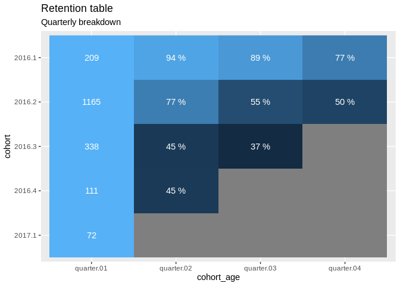
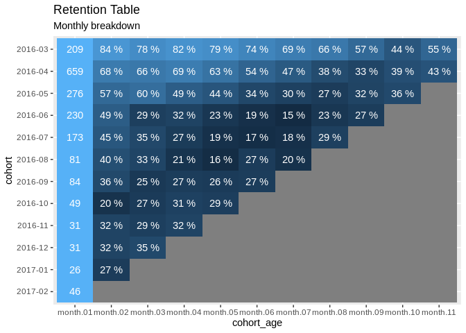

``` r
library(tidyr)
library(dplyr)
library(stringr)
library(ggplot2)
library(lubridate)
```

Data can be downloaded from
[here](https://www.kaggle.com/gspmoreira/articles-sharing-reading-from-cit-deskdrop)

``` r
df <- read.csv("~/code/notebooks/article-rc/data/users_interactions.csv")
df$date <- as.Date(as.POSIXct(df$timestamp, origin = "1970-01-01"))
```

``` r
coh <- data.frame(q = quarter(df$date, with_year = TRUE),
                  user = df$personId,
                  event = df$eventType)

glimpse(coh)
```

    ## Observations: 72,312
    ## Variables: 3
    ## $ q     <dbl> 2016.2, 2016.2, 2016.2, 2016.2, 2016.2, 2016.2, 2016.2, 2016.2,…
    ## $ user  <dbl> -8.845299e+18, -1.032019e+18, -1.130272e+18, 3.442809e+17, -4.4…
    ## $ event <fct> VIEW, VIEW, VIEW, FOLLOW, VIEW, VIEW, VIEW, VIEW, VIEW, VIEW, V…

``` r
coh <- coh %>% 
  group_by(user) %>% 
  mutate(first = min(q)) %>% 
  group_by(first, q) %>% 
  summarise(users = n_distinct(user)) %>% 
  spread(q, users)

coh
```

    ## # A tibble: 5 x 6
    ## # Groups:   first [5]
    ##   first `2016.1` `2016.2` `2016.3` `2016.4` `2017.1`
    ##   <dbl>    <int>    <int>    <int>    <int>    <int>
    ## 1 2016.      209      197      187      161      135
    ## 2 2016.       NA     1165      902      637      582
    ## 3 2016.       NA       NA      338      151      126
    ## 4 2016.       NA       NA       NA      111       50
    ## 5 2017.       NA       NA       NA       NA       72

``` r
shiftrow <- function(v) {
  first_na_index <- min(which(!is.na(v)))
  
  c(v[first_na_index:length(v)], rep(NA, first_na_index - 1))
}

shifted <- data.frame(
  cohort = coh$first,
  t(apply(select(as.data.frame(coh), 2:ncol(coh)), 1, shiftrow))
)

colnames(shifted) <- c("cohort", sub("", "quarter.",
                                     str_pad(1:(ncol(shifted) - 1), 2, pad = "0")))

shifted
```

    ##   cohort quarter.01 quarter.02 quarter.03 quarter.04 quarter.05
    ## 1 2016.1        209        197        187        161        135
    ## 2 2016.2       1165        902        637        582         NA
    ## 3 2016.3        338        151        126         NA         NA
    ## 4 2016.4        111         50         NA         NA         NA
    ## 5 2017.1         72         NA         NA         NA         NA

``` r
shifted_pct <- data.frame(
  cohort = shifted$cohort,
  shifted[,2:nrow(shifted)] / shifted[["quarter.01"]]
)

shifted_pct
```

    ##   cohort quarter.01 quarter.02 quarter.03 quarter.04
    ## 1 2016.1          1  0.9425837  0.8947368  0.7703349
    ## 2 2016.2          1  0.7742489  0.5467811  0.4995708
    ## 3 2016.3          1  0.4467456  0.3727811         NA
    ## 4 2016.4          1  0.4504505         NA         NA
    ## 5 2017.1          1         NA         NA         NA

``` r
p_data_abs <- gather(shifted, "cohort_age", "people", 2:ncol(shifted))
p_data_pct <- gather(shifted_pct, "cohort_age", "percent", 2:ncol(shifted_pct))

labelnames <- c(p_data_abs$people[1:(ncol(shifted)-1)],
                p_data_pct$percent[(ncol(shifted)):(nrow(p_data_pct))])

pretty_print <- function(n) {
  label <- case_when(n <= 1 ~ sprintf("%1.0f %%", n*100),
                     n > 1 ~ as.character(n),
                     TRUE ~ " ")
  
  label
}
```

``` r
p_data <- data.frame(
  cohort = p_data_pct$cohort,
  cohort_age = p_data_pct$cohort_age,
  percentage = p_data_pct$percent,
  label = pretty_print(labelnames)
)
```

``` r
ggplot(p_data, aes(x = cohort_age, y = reorder(cohort, desc(cohort)))) +
  geom_raster(aes(fill = percentage)) +
  scale_fill_continuous(guide = FALSE) +
  geom_text(aes(label = label), color = "white") +
  labs(x = "cohort_age", y = "cohort",
       title = "Retention table",
       subtitle = "Quarterly breakdown")
```

<!-- -->

## Monthly breakdown

``` r
coh <- data.frame(month = format.Date(df$date, "%Y-%m"),
                  user = df$personId,
                  event = df$eventType,
                  stringsAsFactors = FALSE)

glimpse(coh)
```

    ## Observations: 72,312
    ## Variables: 3
    ## $ month <chr> "2016-06", "2016-06", "2016-06", "2016-06", "2016-06", "2016-06…
    ## $ user  <dbl> -8.845299e+18, -1.032019e+18, -1.130272e+18, 3.442809e+17, -4.4…
    ## $ event <fct> VIEW, VIEW, VIEW, FOLLOW, VIEW, VIEW, VIEW, VIEW, VIEW, VIEW, V…

``` r
coh <- coh %>% 
  group_by(user) %>% 
  mutate(first = min(month)) %>% 
  group_by(first, month) %>% 
  summarise(users = n_distinct(user)) %>% 
  spread(month, users)

coh
```

    ## # A tibble: 12 x 13
    ## # Groups:   first [12]
    ##    first `2016-03` `2016-04` `2016-05` `2016-06` `2016-07` `2016-08` `2016-09`
    ##    <chr>     <int>     <int>     <int>     <int>     <int>     <int>     <int>
    ##  1 2016…       209       176       164       171       166       155       145
    ##  2 2016…        NA       659       446       435       454       413       353
    ##  3 2016…        NA        NA       276       156       165       136       121
    ##  4 2016…        NA        NA        NA       230       112        67        73
    ##  5 2016…        NA        NA        NA        NA       173        78        61
    ##  6 2016…        NA        NA        NA        NA        NA        81        32
    ##  7 2016…        NA        NA        NA        NA        NA        NA        84
    ##  8 2016…        NA        NA        NA        NA        NA        NA        NA
    ##  9 2016…        NA        NA        NA        NA        NA        NA        NA
    ## 10 2016…        NA        NA        NA        NA        NA        NA        NA
    ## 11 2017…        NA        NA        NA        NA        NA        NA        NA
    ## 12 2017…        NA        NA        NA        NA        NA        NA        NA
    ## # … with 5 more variables: `2016-10` <int>, `2016-11` <int>, `2016-12` <int>,
    ## #   `2017-01` <int>, `2017-02` <int>

``` r
shifted <- data.frame(
  cohort = coh$first,
  t(apply(select(as.data.frame(coh), 2:ncol(coh)), 1, shiftrow))
)

colnames(shifted) <- c("cohort", sub("", "month.",
                                     str_pad(1:(ncol(shifted) - 1), 2, pad = "0")))

shifted
```

    ##     cohort month.01 month.02 month.03 month.04 month.05 month.06 month.07
    ## 1  2016-03      209      176      164      171      166      155      145
    ## 2  2016-04      659      446      435      454      413      353      308
    ## 3  2016-05      276      156      165      136      121       95       84
    ## 4  2016-06      230      112       67       73       54       43       34
    ## 5  2016-07      173       78       61       46       33       29       32
    ## 6  2016-08       81       32       27       17       13       22       16
    ## 7  2016-09       84       30       21       23       22       23       NA
    ## 8  2016-10       49       10       13       15       14       NA       NA
    ## 9  2016-11       31       10        9       10       NA       NA       NA
    ## 10 2016-12       31       10       11       NA       NA       NA       NA
    ## 11 2017-01       26        7       NA       NA       NA       NA       NA
    ## 12 2017-02       46       NA       NA       NA       NA       NA       NA
    ##    month.08 month.09 month.10 month.11 month.12
    ## 1       138      119       93      115      101
    ## 2       248      218      260      282       NA
    ## 3        75       89       99       NA       NA
    ## 4        54       63       NA       NA       NA
    ## 5        51       NA       NA       NA       NA
    ## 6        NA       NA       NA       NA       NA
    ## 7        NA       NA       NA       NA       NA
    ## 8        NA       NA       NA       NA       NA
    ## 9        NA       NA       NA       NA       NA
    ## 10       NA       NA       NA       NA       NA
    ## 11       NA       NA       NA       NA       NA
    ## 12       NA       NA       NA       NA       NA

``` r
shifted_pct <- data.frame(
  cohort = shifted$cohort,
  shifted[,2:nrow(shifted)] / shifted[["month.01"]]
)

shifted_pct
```

    ##     cohort month.01  month.02  month.03  month.04  month.05  month.06  month.07
    ## 1  2016-03        1 0.8421053 0.7846890 0.8181818 0.7942584 0.7416268 0.6937799
    ## 2  2016-04        1 0.6767830 0.6600910 0.6889226 0.6267071 0.5356601 0.4673748
    ## 3  2016-05        1 0.5652174 0.5978261 0.4927536 0.4384058 0.3442029 0.3043478
    ## 4  2016-06        1 0.4869565 0.2913043 0.3173913 0.2347826 0.1869565 0.1478261
    ## 5  2016-07        1 0.4508671 0.3526012 0.2658960 0.1907514 0.1676301 0.1849711
    ## 6  2016-08        1 0.3950617 0.3333333 0.2098765 0.1604938 0.2716049 0.1975309
    ## 7  2016-09        1 0.3571429 0.2500000 0.2738095 0.2619048 0.2738095        NA
    ## 8  2016-10        1 0.2040816 0.2653061 0.3061224 0.2857143        NA        NA
    ## 9  2016-11        1 0.3225806 0.2903226 0.3225806        NA        NA        NA
    ## 10 2016-12        1 0.3225806 0.3548387        NA        NA        NA        NA
    ## 11 2017-01        1 0.2692308        NA        NA        NA        NA        NA
    ## 12 2017-02        1        NA        NA        NA        NA        NA        NA
    ##     month.08  month.09  month.10  month.11
    ## 1  0.6602871 0.5693780 0.4449761 0.5502392
    ## 2  0.3763278 0.3308042 0.3945372 0.4279211
    ## 3  0.2717391 0.3224638 0.3586957        NA
    ## 4  0.2347826 0.2739130        NA        NA
    ## 5  0.2947977        NA        NA        NA
    ## 6         NA        NA        NA        NA
    ## 7         NA        NA        NA        NA
    ## 8         NA        NA        NA        NA
    ## 9         NA        NA        NA        NA
    ## 10        NA        NA        NA        NA
    ## 11        NA        NA        NA        NA
    ## 12        NA        NA        NA        NA

``` r
p_data_abs <- gather(shifted, "cohort_age", "people", 2:ncol(shifted))
p_data_pct <- gather(shifted_pct, "cohort_age", "percent", 2:ncol(shifted_pct))

labelnames <- c(p_data_abs$people[1:(ncol(shifted)-1)],
                p_data_pct$percent[(ncol(shifted)):(nrow(p_data_pct))])

pretty_print <- function(n) {
  label <- case_when(n <= 1 ~ sprintf("%1.0f %%", n*100),
                     n > 1 ~ as.character(n),
                     TRUE ~ " ")
  
  label
}
```

``` r
p_data <- data.frame(
  cohort = p_data_pct$cohort,
  cohort_age = p_data_pct$cohort_age,
  percentage = p_data_pct$percent,
  label = pretty_print(labelnames)
)
```

``` r
ggplot(p_data, aes(x = cohort_age, y = reorder(cohort, desc(cohort)))) +
  geom_raster(aes(fill = percentage)) +
  scale_fill_continuous(guide = FALSE) +
  geom_text(aes(label = label), color = "white") +
  labs(x = "cohort_age", y = "cohort",
       title = "Retention Table",
       subtitle = "Monthly breakdown")
```

<!-- -->

From the plot above, it is clear that the retailer has issues on 2
areas:

  - Acquisition (cohort size worsening over time)
  - Retention (same as above for first month retention)

It would be interesting to understand (might be added later) which
`eventType` has suffered the most over time to figure where marketing
effort should be focused.
