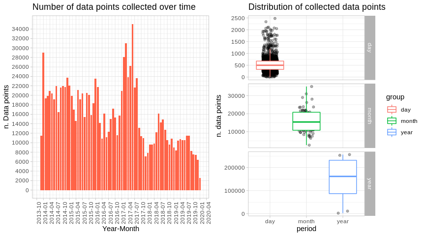
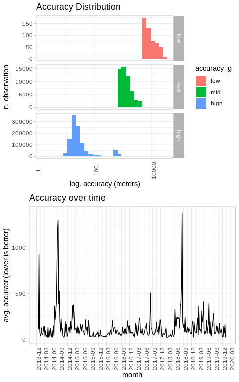
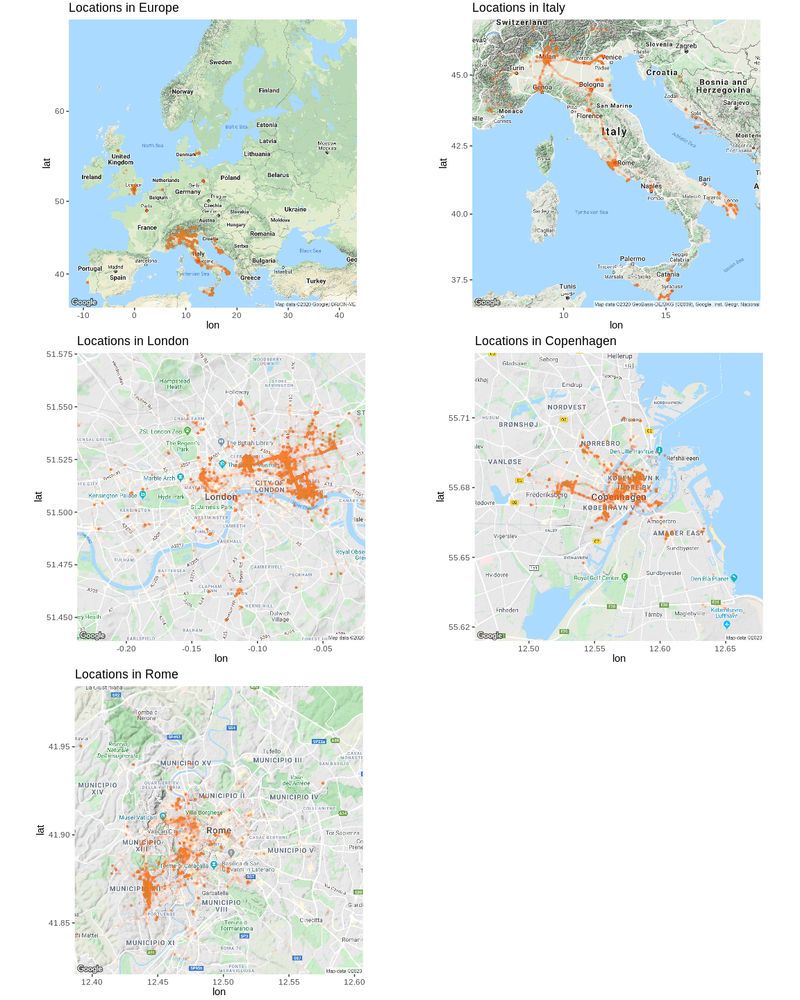
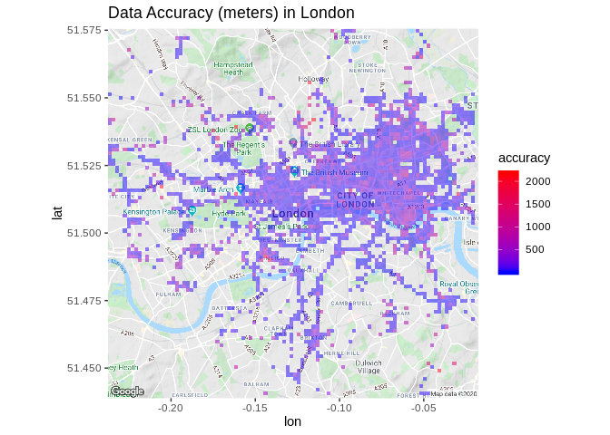
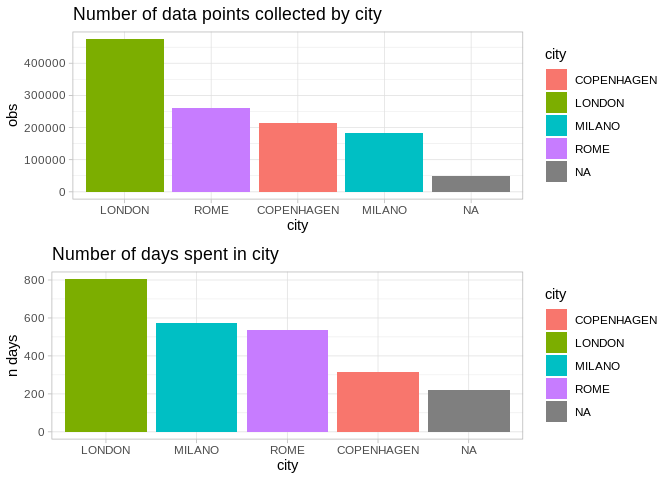
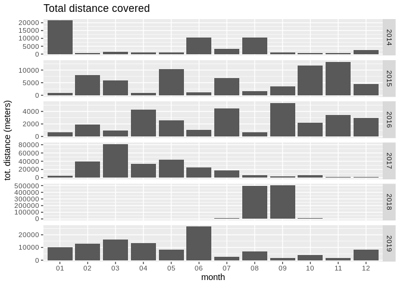
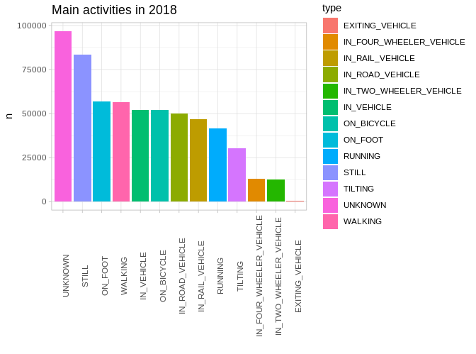

  - [Setup](#setup)
  - [Data preprocess](#data-preprocess)
  - [How big is the dataset?](#how-big-is-the-dataset)
  - [Time distribution](#time-distribution)
  - [Data accuracy](#data-accuracy)
  - [Plot data on maps](#plot-data-on-maps)
  - [Handmade Geocoding - Time spent by
    city](#handmade-geocoding---time-spent-by-city)
  - [Where was the data collected and for how
    long?](#where-was-the-data-collected-and-for-how-long)
  - [Total distance](#total-distance)
  - [Activities](#activities)
  - [Extras - Animations](#extras---animations)

By the end of the year I received a mail from Google with a recap of my
location history for 2019 and didn’t pay much attention to it right away
( other than thinking to turn location services off for good). Since the
data is available (you can download from [Google
Takeout](https://takeout.google.com/settings/takeout)), I thought it’d
be fun to poke into it and get something out of it.  
I’ve ditched my iPhone 4s in 2013 and sticked to Android ever since,
totaling almost 6 full years worth of location history
(`Takeout/Location History.json` totals \~420mb). Since dealing with
large json files can be slow in R, exporting a serialzed dataset with
`saveRDS` can speed things up a fair bit.

## Setup

``` r
options(scipen = 999)
```

``` r
library(dplyr)
library(jsonlite)
library(ggplot2)
library(gridExtra)
library(grid)
library(scales)
library(ggmap)  # to draw fancy maps
library(raster)  # to calc distances between latlon
```

`ggmap` will require providing Google API key (billing will need to be
set up and a credit card will be required). This can be done in two
ways:

  - exporting an environment variable via `export
    GMAPS_API_TOKEN="your_token_string`.
  - reading the token from an `.env` file I put in the project
    directory. I will favor this method since I don’t really like to
    export a variable in `~/.zshrc` for a one-off analysis.  
    **For the love of god, remember to add that file to `.gitignore` to
    avoid accidentally pushing it to Github.**

<!-- end list -->

``` r
# Set gMaps api key
register_google(key = read.dcf(
  ".env",
  fields = "GMAPS_API_TOKEN"
))
```

## Data preprocess

Data comes out with a number of nested fields so we’ll need to flatten
the json fille after reading it into memory.

``` r
data <- fromJSON("Takeout/Location History/Location History.json")
data <- flatten(data$locations)
```

In order to be consumed, couple adjustments are needed:

  - converting timestamps to `UNIX` format
  - converting lat-lon coordinates to GPS format to be able to draw maps

<!-- end list -->

``` r
# Convert timestamps to UNIX format
norm_ts <- function(x) {
  as.POSIXct(as.numeric(x) / 1000,
             origin = "1970-01-01")
}

# Normalise timestamps
data <- data %>% 
  mutate(timestampMs = norm_ts(timestampMs),
         date = as.Date(timestampMs, "%Y-%m-%d"))

# Convert E7 lat lon to GPS coordinates
data <- data %>% 
  mutate(latitudeGPS = latitudeE7 / 1e7,
         longitudeGPS = longitudeE7 / 1e7)
```

After the transformations mentioned above, the final dataset will have
the following structure:

``` r
glimpse(data)
```

    ## Observations: 1,183,157
    ## Variables: 12
    ## $ timestampMs      <dttm> 2013-12-23 03:18:34, 2013-12-23 03:19:34, 2013-12-2…
    ## $ latitudeE7       <int> 418713521, 418713478, 418714064, 418714201, 41871341…
    ## $ longitudeE7      <int> 124414861, 124414780, 124415342, 124415539, 12441475…
    ## $ accuracy         <int> 14, 34, 30, 30, 32, 32, 32, 30, 32, 30, 28, 30, 28, …
    ## $ activity         <list> [NULL, NULL, NULL, <data.frame[1 x 2]>, NULL, <data…
    ## $ altitude         <int> NA, NA, NA, NA, NA, NA, NA, NA, NA, NA, NA, NA, NA, …
    ## $ velocity         <int> NA, NA, NA, NA, NA, NA, NA, NA, NA, NA, NA, NA, NA, …
    ## $ heading          <int> NA, NA, NA, NA, NA, NA, NA, NA, NA, NA, NA, NA, NA, …
    ## $ verticalAccuracy <int> NA, NA, NA, NA, NA, NA, NA, NA, NA, NA, NA, NA, NA, …
    ## $ date             <date> 2013-12-23, 2013-12-23, 2013-12-23, 2013-12-23, 201…
    ## $ latitudeGPS      <dbl> 41.87135, 41.87135, 41.87141, 41.87142, 41.87134, 41…
    ## $ longitudeGPS     <dbl> 12.44149, 12.44148, 12.44153, 12.44155, 12.44148, 12…

  - `timestamp`: original timestamps (in milliseconds) are now converted
    to date objects
  - `accuracy`: the distance around the point in meters
  - `verticalAccuracy`: accuracy measured on a vertical dimension (in
    meters)
  - `activity`: a list of nested dataframes with an inference on the
    type of activity (analysed further down)
  - `latitudeGPS`: latitude converted to GPS format
  - `longitudeGPS`: same as above for longitude values

## How big is the dataset?

``` r
min(data$timestampMs)
```

    ## [1] "2013-12-23 03:18:34 CET"

``` r
max(data$timestampMs)
```

    ## [1] "2020-01-13 18:07:27 CET"

``` r
time_diff <- max(data$timestampMs) - min(data$timestampMs)
n_points <- nrow(data)
```

It seems that Google has collected 1183157 over a period of 2212.62 days
(or 6.06 years).

## Time distribution

For some reason the number of data points collected falls sharply during
summer ’17. Around that time I was moving back to Italy (after around
five years spent in Denmark and the UK). During that time I was
job-hunting and have moved aronud less frequently, it would be
interesting to understand if a less dynamic lifestyle is negatively
correlated to the number of data points collected.

``` r
# Get points collected over time
dp_trend <- data %>% 
  group_by(year_month = as.Date(format(timestampMs, "%Y-%m-01"))) %>%
  summarise(obs = n())

# Get points collected by year, month and day
dp_daily <- data.frame(table(
  format(data$timestampMs, "%Y-%m-%d")), group = "day")

dp_monthly <- data.frame(table(
  format(data$timestampMs, "%Y-%m")), group = "month")

dp_yearly <- data.frame(table(
  format(data$timestampMs, "%Y")), group = "year")

dp <- rbind(dp_daily[,-1], dp_monthly[,-1], dp_yearly[,-1])
```

``` r
# Data points collected over time
trend <- ggplot(dp_trend, aes(year_month, obs)) +
  geom_bar(stat = "identity", fill = "tomato") +
  scale_y_continuous(breaks = seq(0, max(dp_trend$obs), 2000)) +
  scale_x_date(labels = date_format("%Y-%m"), breaks = "3 month") +
  theme_light() +
  theme(axis.text.x = element_text(angle = 90)) +
  labs(title = "Number of data points collected over time",
       x = "Year-Month",
       y = "n. Data points")

# Daily, monthly, yearly collected data points
time_dist <- ggplot(dp, aes(group, Freq)) +
  geom_point(position = position_jitter(width = 0.2), alpha = .3) +
  geom_boxplot(aes(colour = group), outlier.colour = NA) +
  facet_grid(group ~ ., scales = "free") +
  theme_light() +
  labs(title = "Distribution of collected data points",
       x = "period",
       y = "n. data points")

grid.arrange(trend, time_dist, nrow = 1)
```



## Data accuracy

As mentioned above, the dataset contains an `accuracy` field we can use
to get a rough sense of how accurate the collected data is. The most
accurate measurements fall in the region of +/- 60mt, with the vast
majority of observations falling in the *accurate* category. From the
graph below, it seems there are periods of time (specifically during the
summer period) where accuracy degrades consistently. I do believe that
htis might be caused by the fact that I spent the last few summer breaks
in places with subpar network connection, hence the GPS might have had a
hard time pinpointing my exact location.

``` r
# Create accuracy categorical variable =
acc <- data %>%
  dplyr::select(accuracy, timestampMs, date, latitudeGPS, longitudeGPS) %>% 
  filter(!is.na(accuracy)) %>%
  filter(accuracy <= 30000) %>% 
  mutate(accuracy_g = factor(x = (case_when(accuracy < 800 ~ "high",
                                            accuracy < 5000 ~ "mid",
                                            TRUE ~ "low")),
                             levels = c("low", "mid", "high")))

# Accuracy by week
acc_weekly <- acc %>% 
  group_by(date = cut.Date(as.Date(timestampMs, "%Y-%m-%d"),
                           "week")) %>%  
  summarise(avg_accuracy = mean(accuracy))
```

``` r
# Plot ccuracy distribution
acc_dist <- ggplot(acc, aes(accuracy, fill = accuracy_g)) +
  geom_histogram() +
  scale_x_log10() +
  facet_grid(accuracy_g ~ ., scales = "free") +
  theme_light() +
  theme(axis.text.x = element_text(angle = 90)) +
  labs(title = "Accuracy Distribution",
       x = "log. accuracy (meters)",
       y = "n. observation")

# Plot weekly accuracy
acc_trend <- ggplot(acc_weekly, aes(as.Date(date), avg_accuracy, group = 1)) +
  geom_line() +
  scale_x_date(labels = date_format("%Y-%m"), breaks = "3 month") +
  labs(title = "Accuracy over time",
       x = "month",
       y = "avg. accuract (lower is better)") +
  theme_light() +
  theme(axis.text.x = element_text(angle = 90))

grid.arrange(acc_dist, acc_trend, ncol = 1)
```

<!-- -->

## Plot data on maps

Over the past 7 years I had the lucky opportunity to study and work in 3
European cities (Milan, Copenhagen and London). Using
[`ggmap`](https://github.com/dkahle/ggmap) we can easily plot location
data on maps using the good old `ggplot` syntax.

``` r
# Retrieve maps from Google Maps api
maps <- list(
  Europe     = get_map("Europe", zoom = 4),
  Italy      = get_map("Italy", zoom = 6),
  London     = get_map("London", zoom = 12),
  Copenhagen = get_map("Copenhagen", zoom = 12),
  Rome       = get_map("Rome", zoom = 12)
)

# Plot points in locations iteratively
plots <- list()
for (city in names(maps)) {
    p <- ggmap(maps[[city]]) +
      geom_point(data = data, aes(longitudeGPS, latitudeGPS), alpha = 0.01, colour = "tomato",
           size = 0.6) + 
      labs(title = paste0("Locations in ", city)) +
      theme(plot.margin = unit(c(0.1, 0.1, 0.1, 0.1), "cm"))
    
    plots[[city]] <- p
}

# Output plots 
plot_grid <- do.call("grid.arrange", c(plots, ncol = 2))
grid.draw(plot_grid)
```

<!-- -->

For the sake of curiosity we can also check for any pattern in data
accurcacy within a specific city. The same could be done with `velocity`
to inspect if there’s any area that registered faster movements (morning
commute, motorbike trips, etc.).

``` r
# Plot accuracy in London
ldn_acc <- ggmap(maps$London) +
  stat_summary_2d(geom = "tile", bins = 100, data = data, aes(longitudeGPS,
                                                            latitudeGPS,
                                                            z = accuracy),
                alpha = 0.5) +
  scale_fill_gradient(low = "blue", high = "red", guide_legend(title = "accuracy")) +
  labs(title = "Data Accuracy (meters) in London")

ldn_acc
```

<!-- -->

## Handmade Geocoding - Time spent by city

Another question I was interested to answer was how much time did I
spend in each city I’ve lived in. Sadly the dataset doesn’t have any
label to mark the city where the data point was collected in. Here I’ve
evaluated couple strategies to move forward:

  - ❌️ Use [MapBox free geocoding
    API](https://docs.mapbox.com/api/search/) is a no-go as it would
    take too long to process 1.3M rows (request/minute are limited).
  - ❌ Shell out some money for Google Maps API – wasn’t really feeling
    to hit API quotas or spend recklessly.
  - ✔ Do it in hacky way using [airport
    coordinates](http://www.partow.net/miscellaneous/airportdatabase/#Download)
    as reference points. The underlying logic assumes that if data was
    collected within a range of **50 km** (arbitrary cutoff value), it
    is safe to assume that I was in the the same city where the airport
    is located.

After downloading, unzipping and reading airport coordinates, they can
be consumed as lat/lon coordinates.

``` r
# Download cities coordinates (http://www.partow.net/miscellaneous/airportdatabase/index.html#Downloads)
tmpFile <- tempfile()
download.file("http://www.partow.net/downloads/GlobalAirportDatabase.zip",
              tmpFile)

airport_coords <- read.csv(
  unzip(tmpFile, "GlobalAirportDatabase.txt"),
  sep = ":",
  stringsAsFactors = FALSE,
  header = FALSE
)

head(as_tibble(airport_coords), 3)
```

    ## # A tibble: 3 x 16
    ##   V1    V2    V3     V4    V5       V6    V7    V8 V9      V10   V11   V12 V13  
    ##   <chr> <chr> <chr>  <chr> <chr> <int> <int> <int> <chr> <int> <int> <int> <chr>
    ## 1 AYGA  GKA   GOROKA GORO… PAPU…     6     4    54 S       145    23    30 E    
    ## 2 AYLA  LAE   N/A    LAE   PAPU…     0     0     0 U         0     0     0 U    
    ## 3 AYMD  MAG   MADANG MADA… PAPU…     5    12    25 S       145    47    19 E    
    ## # … with 3 more variables: V14 <int>, V15 <dbl>, V16 <dbl>

Geocoding cities ourselves will involve performing the following steps:

1.  Compute distances between my location history and the airports
2.  Finding out which the closest airport is
3.  Grabbing the city label from the airport dataset.

<!-- end list -->

``` r
# Filter relevant airports
airport_coords <- airport_coords %>% 
  filter(V2 %in% c("FCO", "MXP", "LCY", "CPH"))

# Compute distances
distmat <- pointDistance(
  matrix(c(data$longitudeGPS, data$latitudeGPS), ncol = 2),
  matrix(c(airport_coords$V16, airport_coords$V15), ncol = 2),
  lonlat = TRUE
  )

# Get city label and distance to nearest airport
data$nearest_airport <- apply(
  distmat, 1, function(x){
    if (x[which.min(x)] < 50000) airport_coords$V4[which.min(x)] else NA
  }
)

data$dist_nearest_airport <- apply(distmat, 1, min)
```

Which will provide 2 new columns:

  - `dist_nearest_airport`: distance (in meters) to the nearest airport,
    selected from a subset
  - `nearest_airport`: label with the city where the nearest airport is
    located

<!-- end list -->

``` r
data %>% 
  dplyr::select(latitudeGPS, longitudeGPS, dist_nearest_airport, nearest_airport) %>% 
  head(3)
```

    ##   latitudeGPS longitudeGPS dist_nearest_airport nearest_airport
    ## 1    41.87135     12.44149             16943.33            ROME
    ## 2    41.87135     12.44148             16942.53            ROME
    ## 3    41.87141     12.44153             16949.33            ROME

## Where was the data collected and for how long?

It is now possible to plot the number of datapoints collected and the
number of days spent in each city.

``` r
cities_rank <- data %>% 
  group_by(city = as.factor(nearest_airport)) %>% 
  count() %>% 
  arrange(desc(n))

city_time <- data %>% 
  group_by(city = nearest_airport) %>%
  summarise(n_days = n_distinct(date)) %>% 
  arrange(desc(n_days))

cities_rank_p <- ggplot(cities_rank, aes(reorder(city, -n), n, fill = city)) +
  geom_bar(stat = "identity") +
  theme_light() +
  labs(title = "Number of data points collected by city",
       x = "city",
       y = "obs")

city_time_p <- ggplot(city_time, aes(reorder(city, -n_days), n_days, fill = city)) +
  geom_bar(stat = "identity") +
  theme_light() +
  labs(title = "Number of days spent in city",
       x = "city",
       y = "n days")

grid.arrange(cities_rank_p, city_time_p)
```

<!-- -->

## Total distance

In order to retrieve the total distance I’ve covered over the years, it
is needed to compute the distance between each location and the previous
one. Judging from the plot below\_2018\_ needs some further inspection
(beyond the scope of this notebook), as its values look suspicious and
might be originated by some outliers.

``` r
# Lag coordinates to calculate point distance
dist_df <- data %>%
  mutate(latitudeGPS_lag = lag(latitudeGPS, 1),
         longitudeGPS_lag = lag(longitudeGPS, 1))

# Calculate distance (in meterss) between every point
dist_df$dist_to_prev <- pointDistance(
  matrix(c(dist_df$latitudeGPS_lag, dist_df$longitudeGPS_lag), ncol = 2),
  matrix(c(dist_df$latitudeGPS, dist_df$longitudeGPS), ncol = 2),
  lonlat = TRUE)
```

``` r
dist_month <- dist_df %>%
  group_by(month = format(timestampMs, "%m"),
           year = format(timestampMs, "%Y")) %>%
  filter(!year %in% c("2020", "2013")) %>%
  summarise(total_dist = sum(dist_to_prev*0.001, na.rm = TRUE))

ggplot(dist_month, aes(month, total_dist)) +
  geom_bar(stat = "identity") +
  facet_grid(year ~ ., scales = "free") +
  labs(title = "Total distance covered",
       x = "month",
       y = "tot. distance (meters)")
```

<!-- -->

## Activities

It seems that while collecting data, Google also infers the type of
activity we’re performing. This predictions can be found in the nested
dataframes located in the `activity` column. I will only look at
**2018** as unnesting large amounts of nested data can take quite a
while. Surprisingly enough, it looks like I’ve spent most of my time
*activity*, without knowing how this predictions are produced it’s hard
to tell whether or not it is accurate.

``` r
activities <- bind_rows(data$activity)  # Get df of activities

# Format timestmaps
activities <- activities %>%
  mutate(timestampMs = norm_ts(timestampMs))

activities_df <- activities %>%
  filter(format(timestampMs, "%Y") %in% 2018) %>% 
  tidyr::unnest(., activity)
```

``` r
activities_rank <- activities_df %>% 
  group_by(type) %>% 
  count()

ggplot(activities_rank, aes(reorder(type, -n), n, fill = type)) +
  geom_bar(stat = "identity") +
  theme_light() +
  theme(axis.text.x = element_text(angle = 90)) +
  labs(title = "Main activities in 2018",
       x = "")
```

<!-- -->

## Extras - Animations

The data spans across several years, with London being the city where
I’ve generated data for the longest period of time. Through
[`gganimate`](https://github.com/thomasp85/gganimate) we can visualise
the evolution of the recorded locations on a map.

``` r
library(gganimate)

ldn_2018 <- data %>% 
  filter(format(date, "%Y") >= 2016,
         format(date, "%Y") < 2019,
         nearest_airport == "LONDON") %>%
  mutate(month = as.integer(format(date, "%m")))
  
ldn_anim <- ggmap(maps$London) +
  geom_point(data = ldn_2018, aes(longitudeGPS, latitudeGPS), alpha = 0.01, colour = "tomato",
       size = 0.6) + 
  theme(plot.margin = unit(c(0.1, 0.1, 0.1, 0.1), "cm")) +
  transition_time(month) +
  enter_fade() +
  ease_aes() +
  labs(title = "Locations in London")

animate(ldn_anim, renderer = gifski_renderer("ldn_2018.gif"))
```

<!-- -->
